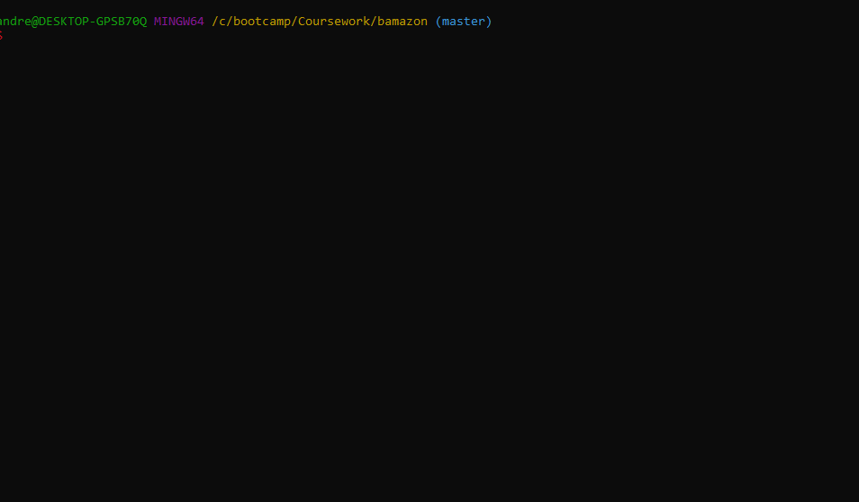
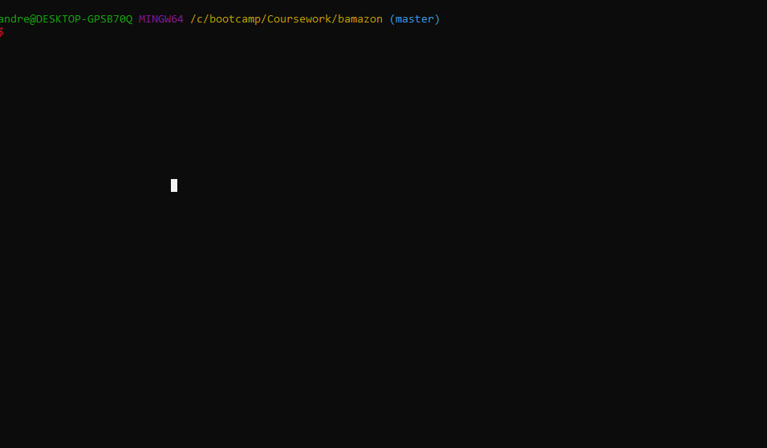

# Bamazon

A Node.js & MySQL command line Amazon-like storefront app that takes in customers orders and depletes stock from the stores Inventory.

## bamazonCustomer.js

## Usage
1. Clone repo
2. npm install
3. cd bamazon
4. node server
5. enjoy!

## bamazonManager.js

